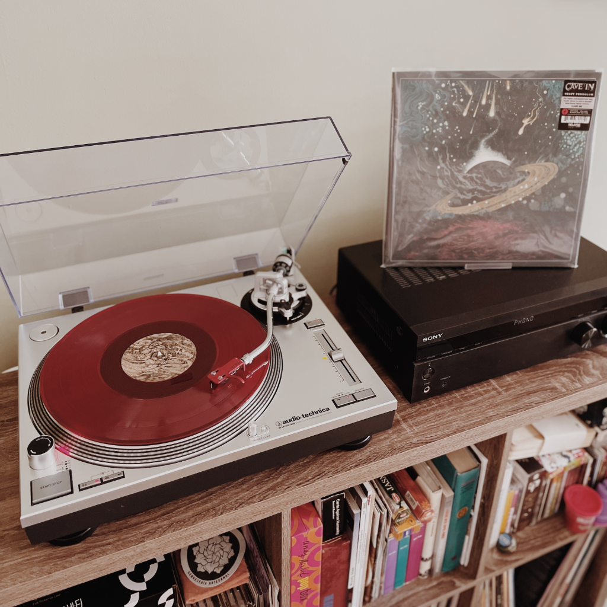

#### <code>Última actualización: {{ page.modified-date }}</code>

Aquí voy poniendo lo que estoy pensando, sintiendo y lo que estoy haciendo actualmente.

## Vida personal 👦🏻

Sigo viviendo con [Marissa][2]{:target="_blank"} en Chihuahua, México. La esposa ya está a punto de terminar su maestría en la [Universidad de Estocolmo][3]{:target="_blank"}, ya está dándole los últimos toques a su tesis y pronto va a tener su ponencia. 🎓

Últimamente hemos estado ya pensando mucho en nuestro futuro y en querer tener bebés, tal vez ya se nos llegó el tiempo de dar el siguiente paso. Yo sigo en tratamiento psicológico, tengo que resolver unos business que traigo ahí internos, para andar lo mejor posible si es que queremos lanzarnos a dar el siguiente paso. 👶🏻🍼

Por lo pronto, el plan es que Marissa se regrese a Chihuahua en junio, estarnos acá un rato en lo que llega el día de su graduación a fin de este año, irnos a Suecia para su graduación y luego ver qué pasa.

Sigo cotorreando todos los días en el [server de Mode 7][4], de los videojuegos que estamos jugando, las series y películas que estamos viendo y disfrutando del cotorreo locochón que se arma con estos dudes y dudettes. 🥴

Hablando de amigos, hace unos días tuve la oportunidad de salir y cotorrear con mis viejos compas Meza y Zuany, se les extrañaba perros. También conecté con Aaron Herrera que ya se nos casa el chavalo en estos días 🤵‍♂️👰‍♂️, nos invitó a mi y a la esposa a su despedida de soltero en [Don Burro][5], pero pues Marissa anda en Suecia y yo anduve malo de salud como por dos semana (todavía sigo un poco malo 🤒) por lo que, con el dolor de mi corazón tuve que faltar. Igual le deseo a él y a su futura esposa lo mejor de lo mejor, felicidad y bendiciones en abundancia.

Y hablando de más casamientos, mañana es la pedida de mano de Paty (al momento de escribir esto), la prometida de mi primo Omar (aka "Marziito"), ahí andaremos acompañándolo al vato, cómo no.

### To-dos 📝

- 👩‍👩‍👧 Sigo desconectadón de mi familia nuclear, pero he hecho lo posible por visitar a mi mamá y convivir en presencialment con ella y mis carnalas

- 🚴‍♂️ He estado saliendo en bici, para ello tuve que desponcharla (es un *pain in the ass* el proceso por el tipo de rin de mi bici, pero se logró), y ya hasta [he estado registrando algunas mis salidas en Strava][6]

- 💦 *Si he estado haciendo el esfuerzo de tomar más agua (for real)*

- 🍺 Ya llevo medio mes sin una gota de alcohol (y contando)

## Trabajo 💼

Las cosas en el trabajo parecen que van a mejorar, entró sangre nueva y estamos realizando una restructuración de los procesos internos para mejorar tanto entrega de desarrollos como una mejora en hacer que la carga de trabajo no sea tan pesada. Ya veremos qué sucede.

## Música 🎶
Esto ha sido lo más relevante musicalmente para mi:

<iframe style="border-radius:12px" src="https://open.spotify.com/embed/album/7tsD5NnZCCk1RxnIIYwY7t?utm_source=generator" width="100%" height="380" frameBorder="0" allowfullscreen="" allow="autoplay; clipboard-write; encrypted-media; fullscreen; picture-in-picture"></iframe>

---

{: .img-fluid.rounded}

La última rola, *Wavering Angel*, qué bárbaros eh. 🔥

## Podcasts 🎙

Sigo escuchando mi podcast favorito:

- 🤘 [*The First Ever Podcast*][7]{:target="_blank"} de Jeremy Bolm

## Videojuegos 🎮
Sigo jugando [*Splatoon 2*][8], ahora con Kty, una amiga chilena que conocí en Discord, ella para que veas si es pro, no que uno ahí dando lástimas 😛, gracias por acoplarme Kty. También agregé *Tetris Effect: Connected* a mi [backlog][9] después de haber terminado su campaña. Juegazo, no tengo manera de expresar lo maravilloso que me pareció. Excelente en todos los aspectos, tanto artísticos, como visuales y mecánicos. Obra maestra para mí.

Y pues sigo esperado ansiosamente a que salga *Splatoon 3*.

---

*Mi página "Now" está inspirada en la de [Derek Sivers][1]{:target="_blank"}*

[1]: https://sive.rs/nowff
[2]: https://www.instagram.com/primitivegirl
[3]: https://www.su.se
[4]: /mode-7/
[5]: https://www.instagram.com/foro.donburro
[6]: https://www.strava.com/athletes/8740264
[7]: https://mixen.mx
[7]: https://podcasts.apple.com/us/podcast/the-first-ever-podcast/id1520216207
[8]: /nintendo/splatoon/
[9]: https://www.backloggd.com/u/mijo